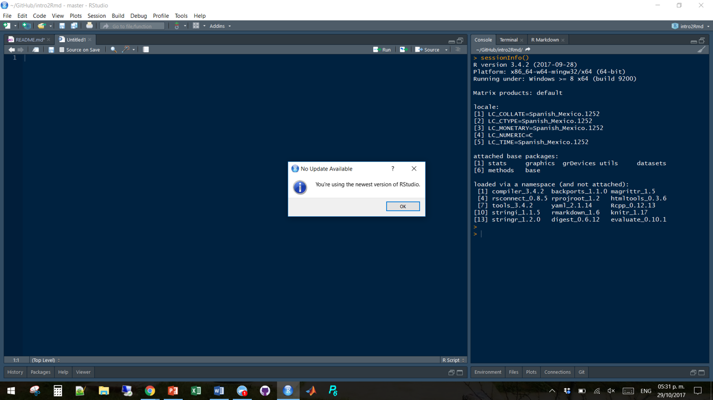

# intro2Rmd

An introductory eco-data science course for R markdown

## Getting started

Before we get to play with R markdound, we need to make sure you have the latest versions of R and R Studio. Then, I'll give a list of basic R packages that we will use, and then some instructions on how to download the materials in this repository (the stuff you see above).

Although it may seem like a lot, it is important that you follow these instructions. This will reduce the chances of running into errors during the workshop, and will help us get through the material. It will not take more than 5 minutes, but make sure you do it well in advance of the workshop. We don't want surprises right before we start, do we?

### R and R Studio

Remember that R and R Studio are two separate things. For now, let's say R is the engine that runs the code, and R Studio is the IDE (Integrated Development Environment... wich is a fancy User Interface) that allows you to interact with R.

1. First, make sure you have the latest releases of R and R Studio. If you have never installed them, skip this and go to the next step.

  - Open R Studio
  - In the Console, type `sessionInfo()` to see which version of R you have. You should be running on R version 3.4.2 or later. In my case, typing that looks like this, and I am only interested in the first line:

Type:
  
```
sessionInfo()
```
You get:
```
R version 3.4.2 (2017-09-28)
Platform: x86_64-w64-mingw32/x64 (64-bit)
Running under: Windows >= 8 x64 (build 9200)

... some other technical stuff follows this
```

  - To see if you are running the latest version of R Studio, use your toolbar to navigate to `Help/Check for Updates`




2. If you have never installed R and R Studio, or need to update them, here are the links. If for any reason they don't work, you can always ask Google.

- [Download R for WINDOWS](https://cran.r-project.org/bin/windows/base/)
- [Download R for OS](https://cran.r-project.org/bin/macosx/)
- [Download RStudio](https://www.rstudio.com/products/rstudio/download/)

### R packages that you will need

As you will see later, we will need some R packages to do some of the things with R Markdown. By now, I assume that you have the latest version of R and R Studio, and you should not run into any problems.

The basic packages we will need are:

- [`rmarkdown`](https://cran.r-project.org/web/packages/rmarkdown/index.html): Dynamic Documents for R
- [`stargazer`](https://cran.r-project.org/web/packages/stargazer/index.html): Well-Formatted Regression and Summary Statistics Tables
- [`knitr`](https://cran.r-project.org/web/packages/knitr/index.html): A General-Purpose Package for Dynamic Report Generation in R
- [`kableExtra`](https://cran.r-project.org/web/packages/kableExtra/index.html): Construct Complex Table with 'kable' and Pipe Syntax

To install them, **one by one**, copy-paste the following ines of code into your console and hit "Enter". You want to wait for a package to finish installing before you install the next one just to make sure there are no problems, This will also make it easier to troubleshoot anything ona a package-by-package basis. This might take a couple of minutes, but be patient.

```
install.packages("rmarkdown")
install.packages("stargazer")
install.packages("knitr")
install.packages("kableExtra")
```

### Getting the course materials

